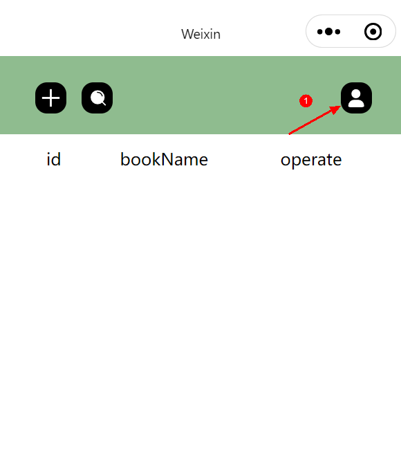
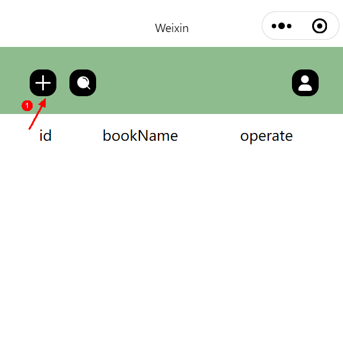
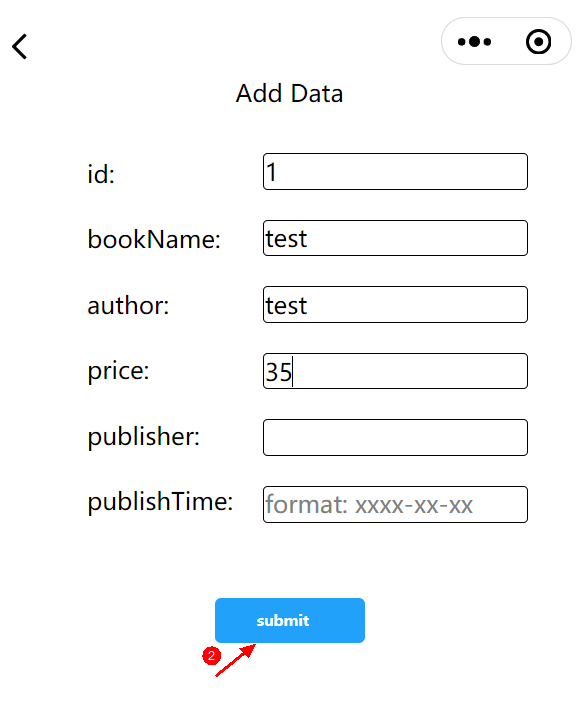
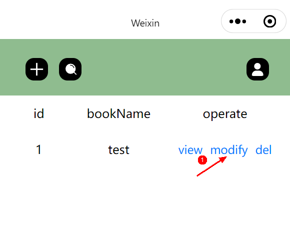
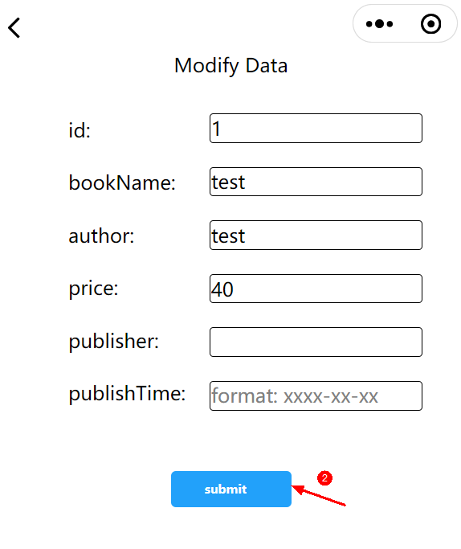
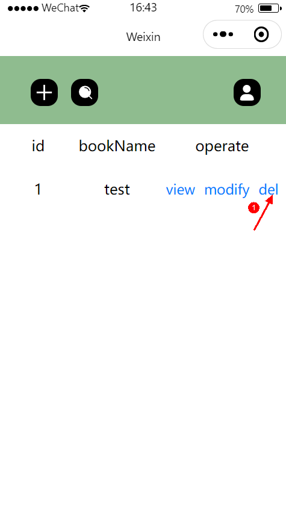
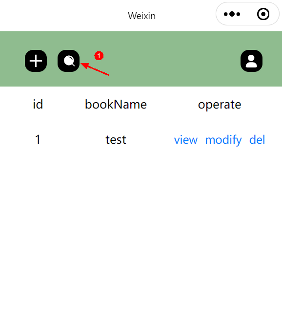
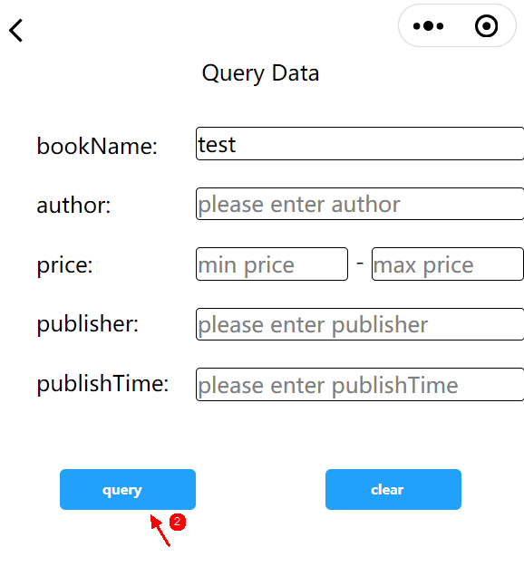

#  Cloud DB JS SDK Demo


## Introduction
This project is a quick start sample developed using Cloud DB JS SDK.

##  Quick Start
- On the [AppGallery Connect](https://developer.huawei.com/consumer/cn/service/josp/agc/index.html#/myProject) page, create a project and add a web application with named `QuickStartDemo`.

- Click **Auth Service** on the navigation bar and enable authentication using an anonymous account.

- Click **Cloud DB** on the navigation bar and enable database service. Then, perform the following operations:

    （1） Create a schema by importing a template file stored in **BookInfo.json** in the `pages/config/` directory of the project. Alternatively, create a object type named **BookInfo** as well and ensure that all fields must be the same as those in `pages/model/BookInfo.js` of the project.

    （2） Create a Cloud DB zone. On the **Cloud DB Zone** tab page, click **Add** to create a Cloud DB zone named **QuickStartDemo**.


- On the Project Setting page, obtain the app configuration information. Save it to the context object in the `pages/config/agconnect-services.js` file.

- Integrate the Cloud DB SDK.

  Run the following command to install the Cloud DB JavaScript SDK service module in the root directory:
        
  ```
    npm install
  ```

## Operate Data

##### 1. Login anonymous.

  

##### 2. Insert a record.

  

  

##### 3. Update a record.

  

  

##### 4. Delete a record.

  

##### 5. Query records.

  

  

